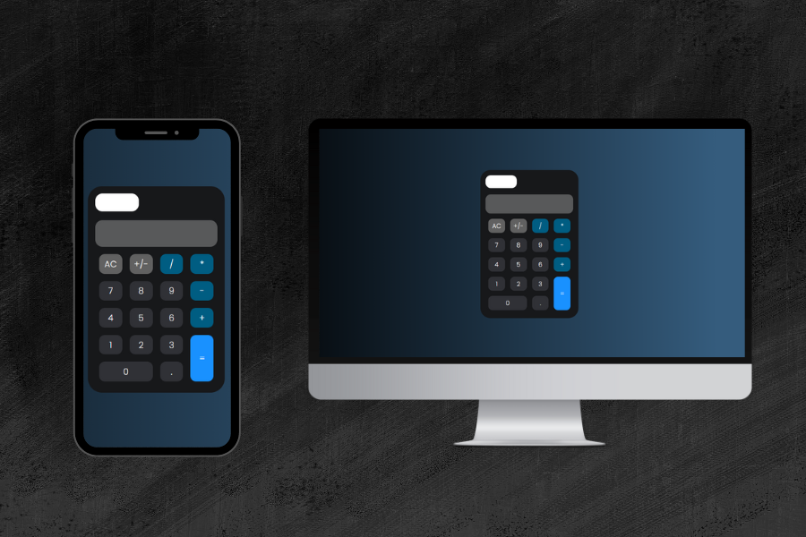

<h1 align="center">Calculadora</h1>

  <a href="#-tecnologias">Tecnologias</a>&nbsp;&nbsp;&nbsp;|&nbsp;&nbsp;&nbsp;
  <a href="#-projeto">Projeto</a>

 

 

## 🚀 Tecnologias

Esse projeto foi desenvolvido com as seguintes tecnologias:

- HTML
- CSS
- JavaScript

## 💻 Projeto

Esse projeto aparenta ser simples mas aborda fundamentos de várias tecnologias.

 Feito com ♥ by Alexandre 

